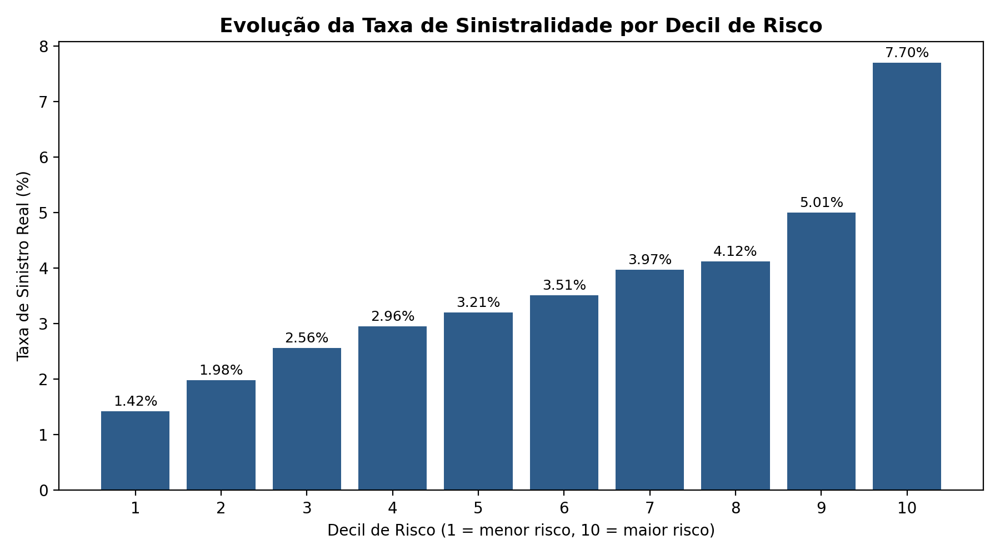

# Projeto de Modelagem de Risco de Sinistro

Projeto de **modelagem preditiva aplicada ao setor de seguros**, desenvolvido com dados da competição *Porto Seguro's Safe Driver Prediction*, do Kaggle.
O objetivo é prever a **probabilidade de ocorrência de sinistro** e segmentar os segurados de acordo com seu nível de risco.

## Objetivos

* Analisar e tratar os dados da carteira;
* Desenvolver modelos de classificação;
* Comparar **Regressão Logística** e **Random Forest**;
* Avaliar o modelo através de **AUC e Gini**;
* Identificar as variáveis mais relevantes;
* Segmentar os segurados em **10 decis de risco**.

## Metodologia

* Tratamento de valores ausentes;
* One-Hot Encoding para variáveis categóricas;
* Imputação pela mediana;
* Divisão em treino e teste com estratificação;
* Treinamento de Regressão Logística e Random Forest;
* Avaliação através de AUC e Gini;
* Segmentação dos segurados por nível de risco.

Como o dataset apresenta aproximadamente **3,6% de sinistros**, foi utilizado `class_weight='balanced'` para lidar com o desbalanceamento das classes.

## Resultados

**Random Forest**

* **AUC:** 0.628
* **Gini:** 0.255

O modelo foi utilizado para estimar a probabilidade de sinistro e classificar os segurados em 10 decis de risco.
A segmentação permite analisar se a **taxa real de sinistros aumenta conforme o risco previsto pelo modelo**, avaliando sua capacidade de ordenação da carteira.

### Sinistralidade por Decil

A tabela de segmentação está disponível em:
`outputs/segmentacao_risco.xlsx`

## Tecnologias
**Python | Pandas | NumPy | Scikit-learn | Matplotlib | Seaborn | Excel | Google Colab**

## Aplicação atuarial

A abordagem pode ser utilizada como ferramenta de apoio à **segmentação de risco, análise de sinistralidade, subscrição e estudos de pricing** em seguros.

## Autor
*Fellipe Oliveira*
Ciências Atuariais e Estatística — UFRJ

